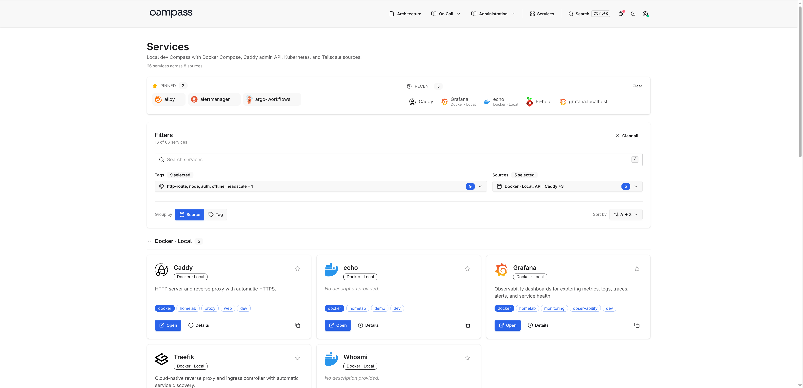

<p align="center">
  
</p>

<p align="center">
  <strong>Una página de aterrizaje para tus servicios, paneles y documentos, descubiertos automáticamente desde fuentes como Docker, Kubernetes y Tailscale.</strong>
</p>

<p align="center">
  <a href="https://adinhodovic.github.io/compass/getting-started/"><strong>Primeros pasos</strong></a>
  ·
  <a href="https://adinhodovic.github.io/compass/"><strong>Documentación</strong></a>
  ·
  <a href="https://adinhodovic.github.io/compass/demo/"><strong>Demo</strong></a>
</p>

<p align="center">
  
</p>

## ¿Por qué Compass

Agrega una fuente y Compass renderizará lo expuesto en una interfaz impulsada por el servidor, con estado de la fuente, etiquetas, metadatos y contexto del operador. Busca, filtra, depura y accede a los servicios sin mantener un montón de tarjetas escritas a mano.

- Fuentes de Docker, Kubernetes, Tailscale, Headscale, configuración estática y API JSON.
- Estado de salud de la fuente, estado de actualización, metadatos del servicio, paneles, etiquetas y vistas de depuración.
- HTML renderizado en el servidor con HTMX, Alpine.js, Tailwind y daisyUI.

## Inicio rápido

Fuente de Docker `compass.yaml`:

```yaml
organization:
  name: Homelab

services:
  sources:
    - type: docker
      name: local
```

```bash
# Add the host's docker GID so the non-root container user can read the socket. Alternatively use: tecnativa/docker-socket-proxy
docker run --rm -p 8080:8080 \
  --group-add $(getent group docker | cut -d: -f3) \
  -v /var/run/docker.sock:/var/run/docker.sock:ro \
  -v $PWD/compass.yaml:/etc/compass/compass.yaml:ro \
  adinhodovic/compass:latest \
  -c /etc/compass/compass.yaml
```

Fuente de Kubernetes `compass.yaml`:

```yaml
organization:
  name: Homelab

services:
  sources:
    - type: kubernetes
      name: cluster # Helm grants in-cluster RBAC for discovery
      kubernetes:
        namespaces: []
```

```bash
helm install compass oci://ghcr.io/adinhodovic/charts/compass -n compass --create-namespace --set-file config=compass.yaml
```

Consulta [Primeros pasos](https://adinhodovic.github.io/compass/getting-started/) para ver una configuración mínima y ejemplos de fuentes.
