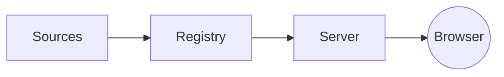

# Compass architecture

```
Config
  -> Sources (docker, api, kubernetes, tailscale, static)
  -> Normalized services
  -> Registry (sort, group, catalog backfill)
  -> Server-rendered UI (HTMX + Alpine)
```

## Catalog as the normalizer

The catalog (`internal/catalog/services.yaml` plus optional overrides in
`deploy/dev/catalog/`) is the source of truth for service metadata defaults.
The registry fills in `description`, `icon`, and `tags` from the matching
catalog entry whenever a source did not provide them.

Source-provided fields always win. Static services in `compass.yaml` can
therefore lean on the catalog (omit `icon`/`description` and let the catalog
fill them) or override anything inline.

## Pages

Markdown pages (this one included) live under `pages.dir`. They share the
nav and toast / theme state with the rest of the app but render their content
through `goldmark` inside a `prose` container.

### Embedding services

Pages can render a live card grid of any subset of the catalog with
`` or ``. The
shortcode expands at request time, so the cards always reflect the current
sources.

Example — services discovered from the local Docker daemon:



Example — anything tagged `homelab` (the static `manual` source applies that
tag to all of its entries):



### Inline service references

Wiki-style brackets resolve to a service link. For example, [[grafana]]
points at the Grafana detail page. Unknown names like [[never-heard-of-it]]
pass through as plain text.

Need to spotlight one service? Use ``:



### Embedded panels

``
pulls a single Grafana panel from the local Docker service's `panels:` list:



### Diagrams and code blocks

Fenced code blocks pick up syntax highlighting (chroma, github-dark
theme):

```go
package main

func main() {
    println("hello, compass")
}
```


