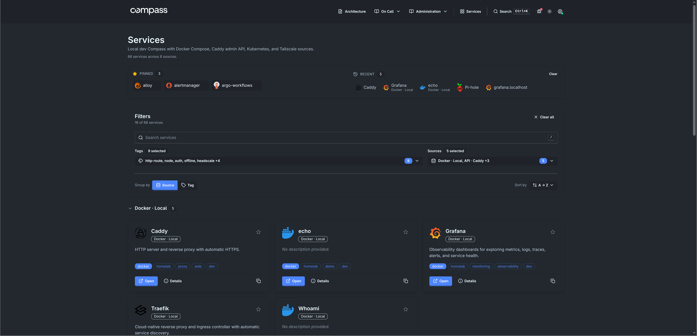
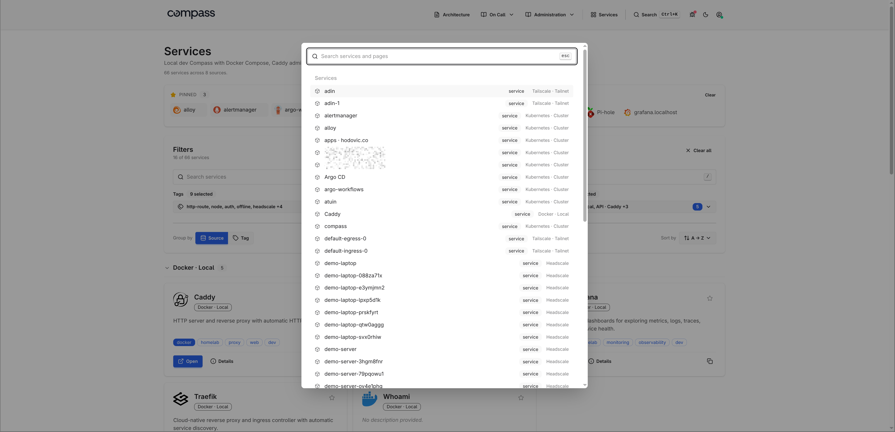
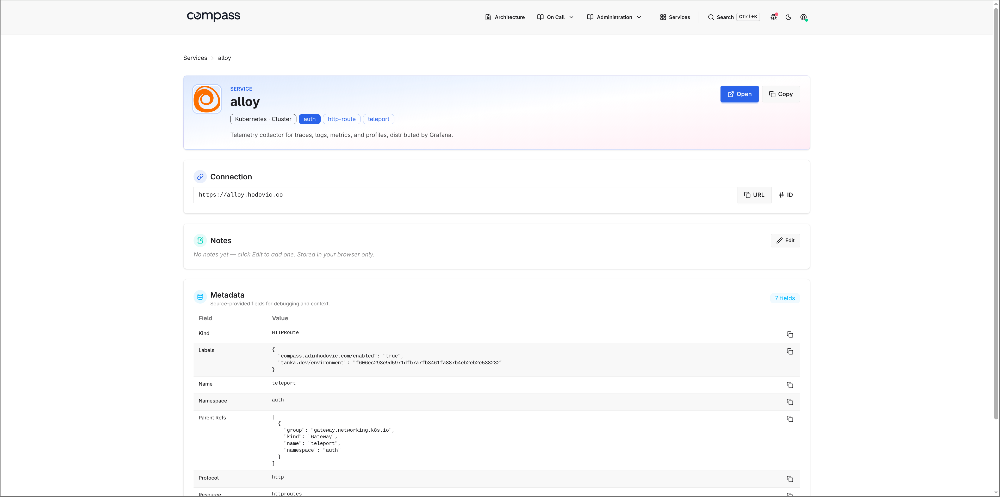
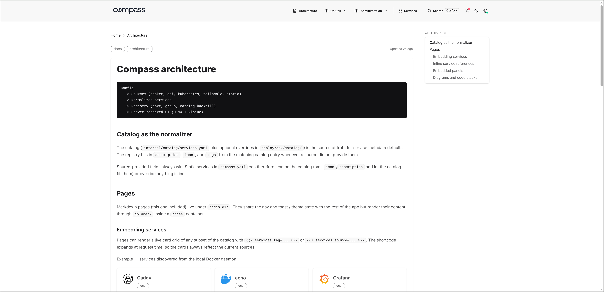

# Demo

A quick visual tour of Compass using the local development stack.

## Services Dashboard

The services dashboard is the primary operator view: discovered services,
source-aware grouping, filters, pinned services, recent services, and quick
actions in one place.

The same dashboard supports theme switching without changing the underlying
server-rendered UI.

Search narrows the registry quickly and keeps filters, grouping, and sort
controls close to the results.

Each service has a detail page with its URL, metadata, tags, embedded
Grafana panels, and backlinks to any markdown pages that reference it.

## Pages

Compass can render markdown pages alongside the dashboard. Use them for
runbooks, architecture notes, on-call docs, and other operator context.

Pages can also embed live service cards and Grafana panels so documentation
stays connected to the currently discovered registry.

## Debug

The debug page shows per-source health and the services each source returned.
It is useful when a service is missing, duplicated, or coming from an
unexpected source.

