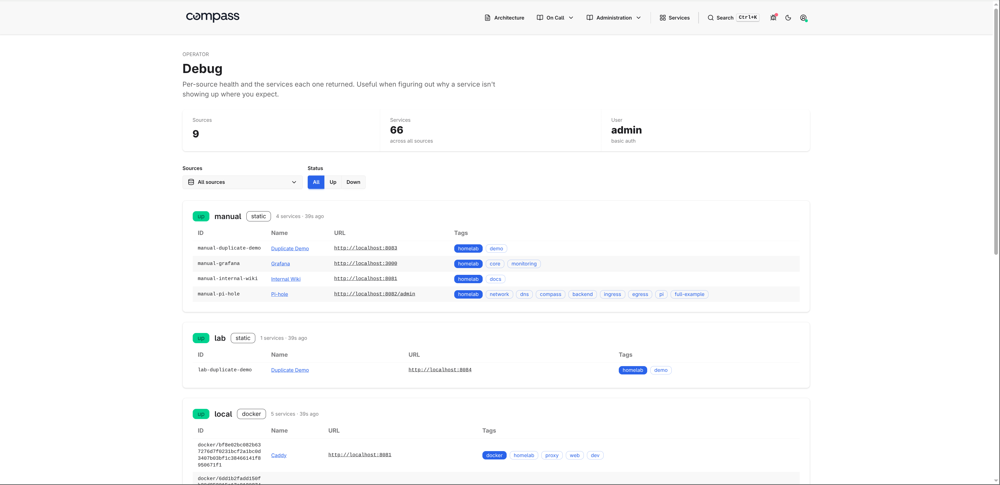

# Operations

Runtime tools for checking Compass: debug, health, metrics, logs, and
troubleshooting.

## Runtime endpoints

The operator-facing endpoints are `/debug`, `/health`, `/metrics`, and
`/api/services`. The dashboard, service detail pages, markdown pages, static
assets, and manifest are normal UI routes covered in [Getting Started](getting-started.md)
and [Pages](pages.md).

## `/debug`

A per-source health view. For every configured source it shows a
status badge (`ok` / `error` / `pending`), the service count and last
load time, the discovery output as a table, and the error message when
the last refresh failed. Published services include a **Why included**
section that explains registry decisions such as URL normalization, generated
IDs, catalog backfills, and invalid link or panel removal. Dropped services
show the validation or filter reason that removed them.

The navbar bug icon shows a small red dot whenever any source's last
load reported an error, so you don't have to keep `/debug` open to know
something is unhealthy.

On by default. Set `debug.enabled: false` in `compass.yaml` to suppress
the route. Any request to `/debug` then returns 404.



## `/health`

Liveness endpoint for load balancers and orchestrators. Returns HTTP 200
with `{"status":"ok"}` and is unauthenticated regardless of the configured
auth mode.

## `/api/services`

`GET /api/services` returns the current normalized service registry as JSON:

```json
{
  "services": [
    {
      "id": "static-manual-grafana",
      "name": "Grafana",
      "url": "https://grafana.example.com",
      "source": "manual",
      "source_type": "static",
      "tags": ["monitoring"]
    }
  ]
}
```

The endpoint uses normal Compass authentication and source access rules. It
returns only services visible to the current caller, and it does not expose
dropped services or raw source credentials. Responses use `Cache-Control:
no-store` because discovery data can change between refreshes.

## `/metrics`

Prometheus exposition format. Default scrape config is fine; the
endpoint is unauthenticated regardless of the configured auth mode so
scrapers don't need credentials.

| Metric                                          | Type      | Labels                                |
| ----------------------------------------------- | --------- | ------------------------------------- |
| `compass_http_requests_total`                    | counter   | `route`, `method`, `status`           |
| `compass_http_request_duration_seconds`          | histogram | `route`                               |
| `compass_source_refresh_total`                   | counter   | `source`, `outcome` (success\|error)  |
| `compass_source_refresh_duration_seconds`        | histogram | `source`                              |
| `compass_source_services`                        | gauge     | `source`                              |
| `compass_source_last_success_timestamp_seconds`  | gauge     | `source`                              |

The `source` label uses Compass's canonical `<type>/<name>` source identity,
for example `kubernetes/cluster`.

`last_success_timestamp_seconds` is the Unix time of the most recent
successful refresh. Pair with `time()` for stale-source alerting:

```promql
time() - compass_source_last_success_timestamp_seconds > 600
```

A ServiceMonitor for prometheus-operator ships with the Helm chart;
enable it with `serviceMonitor.enabled: true`.

## Logs

Every HTTP request emits one structured log line: method, path, status,
byte count, duration, and remote address. Source refresh outcomes log
here too. `/health`, `/static/*`, and `/metrics` log at `debug` to keep
probe and scrape traffic quiet; everything else logs at `info`. 5xx
responses always log at `error`.

Configure the format and level in `compass.yaml` under
[`logging:`](configuration.md#logging).

## Troubleshooting

Compass exposes three places to check when something looks wrong:

- `/debug`: per-source status, service counts, last successful load time, raw
  source errors, and the discovered service table.
- `/metrics`: scrapeable source refresh counters, refresh duration, service
  counts, and last-success timestamps.
- Logs: startup validation errors, source refresh outcomes, HTTP requests, and
  5xx responses.

Source identities use `<type>/<name>`, for example `kubernetes/cluster`. Use
that value to match a source across `/debug`, metrics labels, and logs.

### Compass Will Not Start

Config errors are printed during startup and include the field that failed
validation. For the full config reference, see [Configuration](configuration.md).
