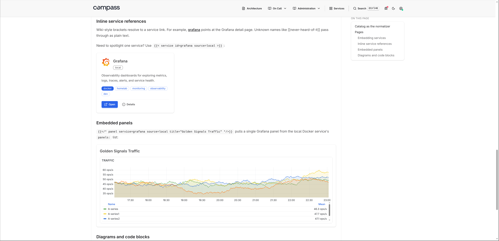
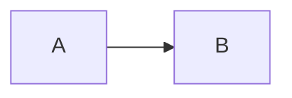

# Pages

Optional. Drop markdown files in a directory and they show up as additional
Compass pages, linked from the navbar.

## Configuration

```yaml
pages:
  dir: pages
```

Path is resolved relative to the directory `compass.yaml` lives in (so
relative paths work the same regardless of where you run the binary from).
Absolute paths also work.

## File layout and navbar mapping

The directory structure drives the navbar:

```text
pages/
├── architecture.md           # top-level: direct nav link "Architecture"
├── changelog.md              # top-level: direct nav link "Changelog"
├── administration/           # sub-dir: "Administration" dropdown
│   ├── access-policies.md
│   └── billing.md
└── on-call/                  # sub-dir: "On Call" dropdown
    ├── escalation.md
    └── runbook.md
```

- Top-level `*.md` files become standalone navbar links. Useful when there
  are only a few pages or when a page is important enough to deserve its
  own slot (e.g. an architecture overview).
- Sub-directories become dropdowns. URLs are `/pages/{section}/{slug}`
  for nested files and `/pages/{slug}` for top-level ones.

Section (dropdown) titles are derived from the directory name (`on-call`
becomes "On Call"). Prefix with a number to control order:
`01-administration/`, `02-on-call/`. The prefix is stripped from the
display title.

## Front-matter

Optional YAML at the top of each file:

```markdown
---
title: Access Policies
order: 2
tags: [security, governance]
---

# Access policies

…
```

| Key     | Notes                                              |
| ------- | -------------------------------------------------- |
| `title` | Used in nav and breadcrumb. Defaults to the slug. |
| `order` | Sort order ascending; pages without one sort by title. |
| `tags`  | Rendered as badges on the page header.            |

## Custom home page

Any page in the directory can be promoted to the site root with the `home`
config:

```yaml
home:
  page: welcome           # renders pages/welcome.md at "/"
  # section: on-call      # optional sub-dir; with page: runbook above, renders pages/on-call/runbook.md
```

When `home.page` is set, `/` renders that markdown file. The services
dashboard moves to `/services` (and is linked from the navbar). When
`home.page` is unset, `/` continues to render the services dashboard
directly. The two URLs (`/` and `/services`) are equivalent in that
mode.

## Service shortcodes

### Filtered service card grid

Embed a live, filtered list of currently-discovered services anywhere
in a markdown page:

```markdown
## Monitoring stack



## Caddy-managed apps


```

| Key      | Effect                                                |
| -------- | ----------------------------------------------------- |
| `tag`    | Only include services that carry this tag             |
| `source` | Only include services from this source instance name  |

### Single service card

For runbooks that spotlight one specific service:

```markdown

```

If multiple sources expose a service with the same name, add `source=`:

```markdown

```

### Embedded Grafana panel

Pull one panel out of a service's `panels:` list and render it inline as
an iframe:

```markdown

```

If multiple sources expose a service with the same name, add `source=` to pick
the source instance:

```markdown

```



### `[[name]]` — wiki-style auto-links

`[[grafana]]` or `[[Grafana]]` in prose resolves to a link at
`/services/grafana`. Matches by ID or display name (case-insensitive).
Unknown names pass through as literal text. Doesn't fire inside code
spans or fenced blocks.

### Showing the literal syntax

To render `` without expanding, use the Hugo-style escape:
`` and ``.

Shortcode-looking text inside inline code spans or fenced code blocks is left
literal, so examples like `` `` `` are safe.

## Code blocks and diagrams

Fenced code blocks pass through [chroma](https://github.com/alecthomas/chroma) for server-side syntax
highlighting (github-dark theme out of the box; class-based, swappable
without rebuilding the binary).

Mermaid diagrams render client-side from ` ```mermaid ` blocks:

````markdown

````

## Service backlinks

When you reference a service via any of the shortcodes above (or a
`[[service]]` wiki-link), the service's detail page picks it up and
shows a "Mentioned in" section linking back to your page. Useful for
keeping runbooks discoverable from `/services/{id}`.
